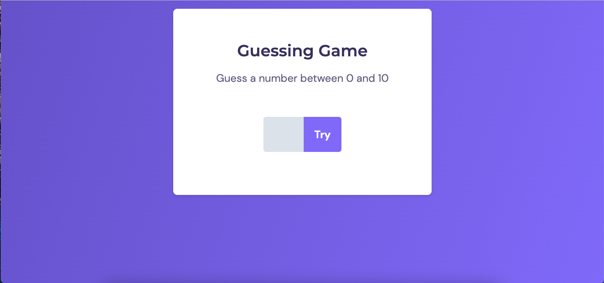

<h1 align="center"> Guessing Game - Simple </h1>

  <a href="#-tecnologias">Technology</a>&nbsp;&nbsp;&nbsp;|&nbsp;&nbsp;&nbsp;
  <a href="#-projeto">Project</a>&nbsp;&nbsp;&nbsp;|&nbsp;&nbsp;&nbsp;
  <a href="#-layout">Layout</a>&nbsp;&nbsp;&nbsp;|&nbsp;&nbsp;&nbsp;
  <a href="#memo-licença">License</a>

 

<h2 align="center"> Design </h2>

  

## 🚀 Technology

This project was developed with the technologies below:

- HTML and CSS
- Git and Github
- JavaScript

## 💻 Project

This is a Guessing Game. You need to choose one number between 0 and 10. The game will show the number of attempts after you hit the right number  

## :memo: License

This project is above the MIT license.

## link

<a href="https://gustavozonta.github.io/guessingame/" target="_blank"> Guessing Game </a>

---

 Made  ♥  by Gustavo Zonta
